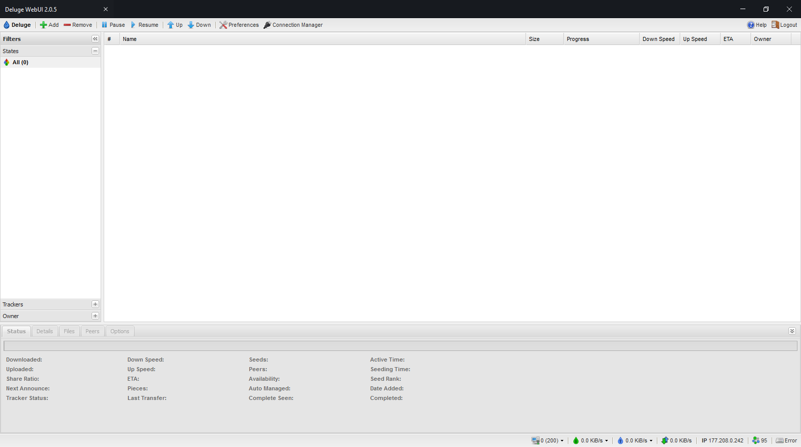
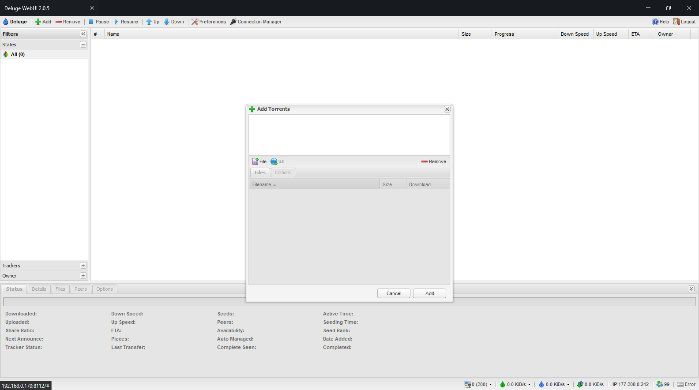
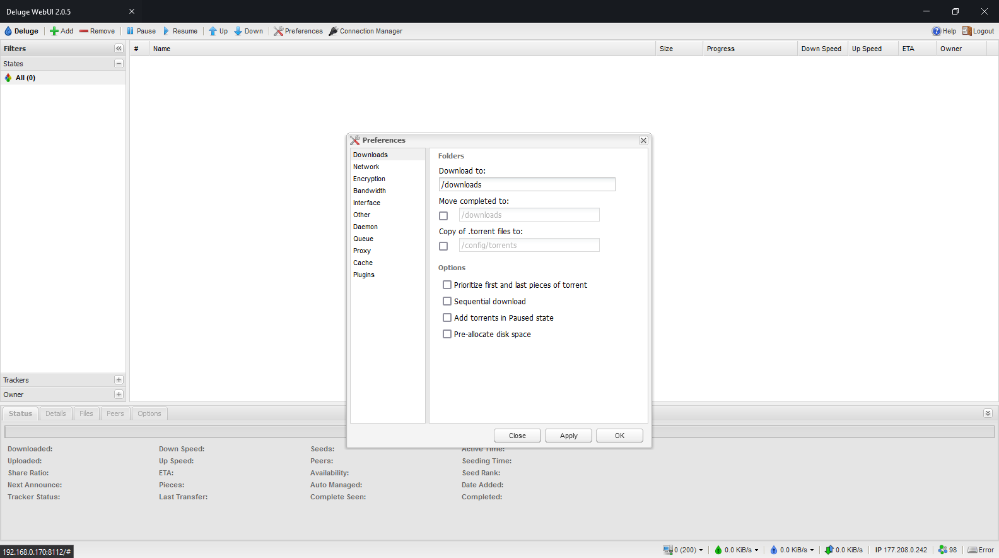

Deluge is a BitTorrent client that utilizes a daemon/client model. It has various user interfaces available such as the GTK-UI, Web-UI and Console-UI. It uses libtorrent at its core to handle the BitTorrent protocol.

<tbody>
  <tr>
    <td></th>
    <td>
      <h2>Add torrents</h2>
      List torrents you want to download</th>
  </tr>
  <tr>
  <tr>
    <td></th>
    <td>
      <h2>Preferences</h2>
      Check all your preferences</th>
  </tr>
  <tr>
</tbody>