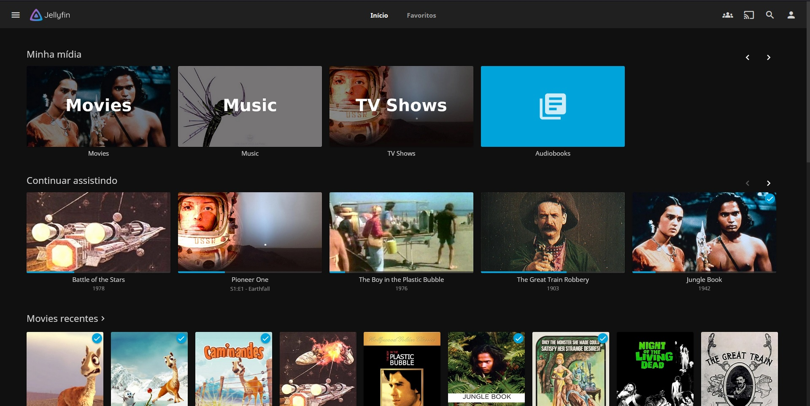

Jellyfin is a Free Software Media System that puts you in control of managing and streaming your media:

-  There are no strings attached.
-  No premium licenses or features.
-  No hidden agendas: just a team who want to build something better and work together to achieve it.

## Easy.

Jellyfin is a Free Software Media System that puts you in control of managing and streaming your media. It is an alternative to the proprietary Emby and Plex, to provide media from a dedicated server to end-user devices via multiple apps. Jellyfin is descended from Emby's 3.5.2 release and ported to the .NET Core framework to enable full cross-platform support.

## Lean.

Jellyfin is a cross-platform and alternative to propriety media streaming applications such as Emby and Plex. Jellyfin is easy to install and set up and accessible via the browser. Clients can connect devices to your Jellyfin server and let you view your content on any supported device. Jellyfin allows you to organize your movies, TV shows, music and photos in one beautiful interface and stream those media files on your PC, tablet, phone, TV, Roku, etc on the network or over the Internet.