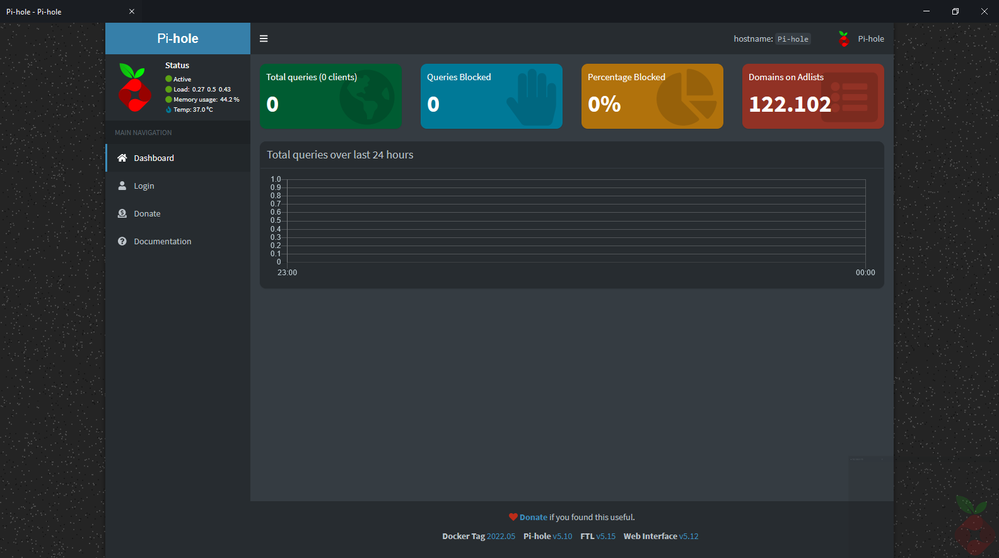
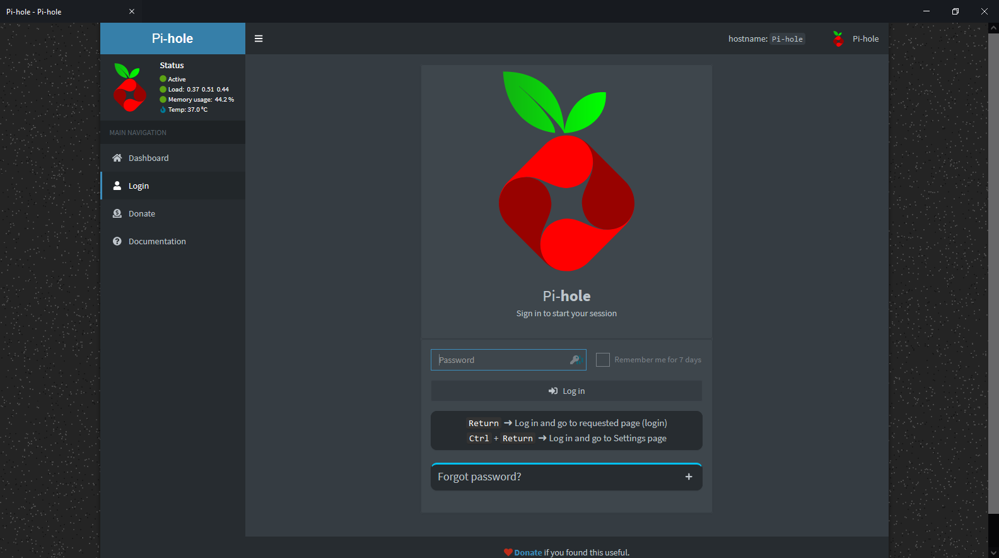

Pi-hole is a general purpose network-wide ad-blocker that protects your network from ads and trackers without requiring any setup on individual devices. It is able to block ads on any network device (e.g. smart appliances), and, unlike browser add-ons, Pi-hole blocks ads on any type of software.

<table>
<thead>
 
</thead>
<tbody>
  <tr>
    <td></th>
    <td>
      <h2>Login</h2>
      Login in to enjoy your privacy.</th>
  </tr>

  <tr>
    <td></th>
    <td>
      <h2>Dashboard</h2>
      Check all the use & blocked ad's</th>
  </tr>
</tbody>
</table>

# The Pi-hole
is a DNS sinkhole that protects your devices from unwanted content, without installing any client-side software.

- Easy-to-install: our versatile installer walks you through the process and takes less than ten minutes

- Responsive: seamlessly speeds up the feel of everyday browsing by caching DNS queries

- Lightweight: runs smoothly with minimal hardware and software requirements

- Robust: a command-line interface that is quality assured for interoperability

- Insightful: a beautiful responsive Web Interface dashboard to view and control your Pi-hole

- Versatile: can optionally function as a DHCP server, ensuring all your devices are protected automatically

- Scalable: capable of handling hundreds of millions of queries when installed on server-grade hardware

- Modern: blocks ads over both IPv4 and IPv6

- Free: open-source software which helps ensure you are the sole person in control of your privacy

