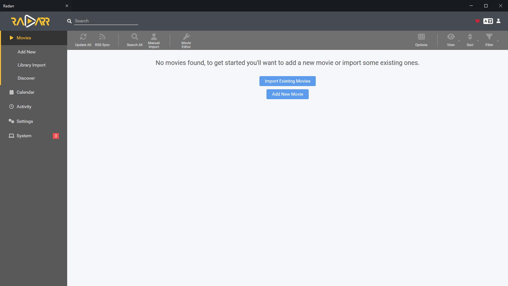
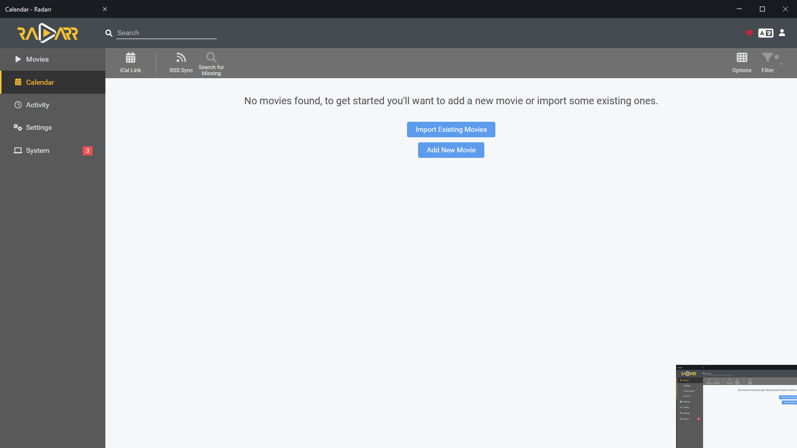
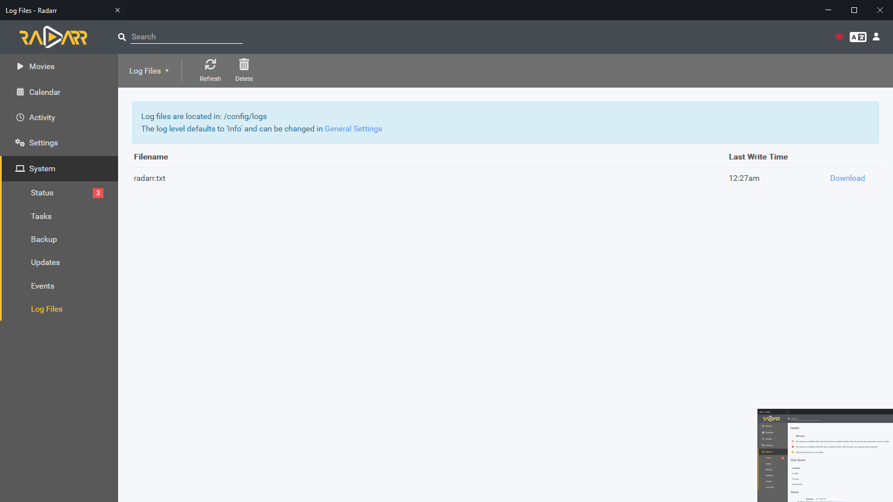
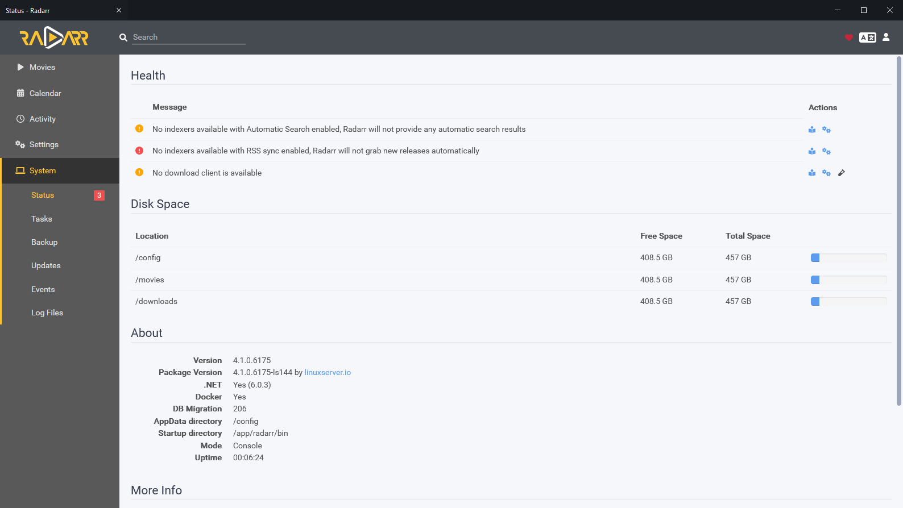

<div style="margin-bottom:50px;margin-top:50px;display:flex;align-items:center;">

  

  ```
  Radarr
  Movie collection manager for Usenet and BitTorrent users.
  ```

</div>

<table>
  <td>
    <tr></tr>
    <tr>Radarr home dashboard</tr>
  </td>
</table>

Radarr is a movie collection manager for Usenet and BitTorrent users. It can monitor multiple RSS feeds for new movies and will interface with clients and indexers to grab, sort, and rename them. It can also be configured to automatically upgrade the quality of existing files in the library when a better quality format becomes available. Note that only one type of a given movie is supported. If you want both an 4k version and 1080p version of a given movie you will need multiple instances.

<table>
<thead>
 
</thead>
<tbody>
  <tr>
    <td></th>
    <td>
      <h2>Calendar</h2>
      See all your upcoming episodes in one convenient location.</th>
  </tr>
  <tr>
    <td>  </td>
    <td>
      <h2>Log files</h2>
      Find all the releases, choose the one you want and send it right to your download client.
    </td>
  </tr>
  <tr>
    <td>
      
    </td>
    <td>    
      <h2>Automatic Failed Download Handling </h2>
      Radarr makes failed downloads a thing of the past. Password protected releases, missing
repair blocks or virtually any other reason? no worries. Sonarr will automatically blacklist the release and tries another one until it finds one that works.
    </td>
  </tr>
    <tr>
    <td>  </td>
    <td>
      <h2>System health</h2>
      Check the system health status
    </td>
  </tr>
</tbody>
</table>
