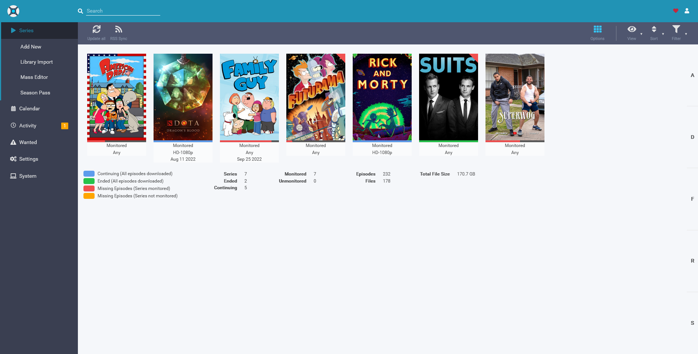
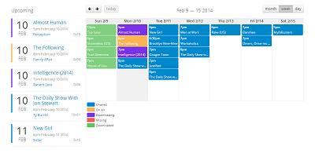
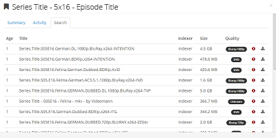
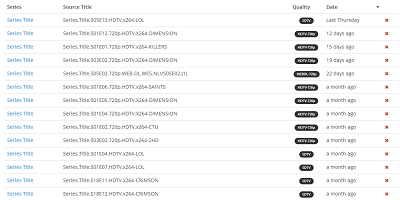

<table>
  <td>
    <tr></tr>
    <tr>Sonarr home dashboard</tr>
  </td>
</table>

Sonarr (formerly NZBdrone) is a PVR for usenet and bittorrent users. It can monitor multiple RSS feeds for new episodes of your favorite shows and will grab, sort and rename them. It can also be configured to automatically upgrade the quality of files already downloaded when a better quality format becomes available.

<table>
<thead>
 
</thead>
<tbody>
  <tr>
    <td></th>
    <td>
      <h2>Calendar</h2>
      See all your upcoming episodes in one convenient location.</th>
  </tr>
  <tr>
    <td>  </td>
    <td>
      <h2>Manual Search</h2>
      Find all the releases, choose the one you want and send it right to your download client.
    </td>
  </tr>
  <tr>
    <td>
      
    </td>
    <td>    
      <h2>Automatic Failed Download Handling </h2>
      Sonarr makes failed downloads a thing of the past. Password protected releases, missing
repair blocks or virtually any other reason? no worries. Sonarr will automatically blacklist the release and tries another one until it finds one that works.
    </td>
  </tr>
</tbody>
</table>
